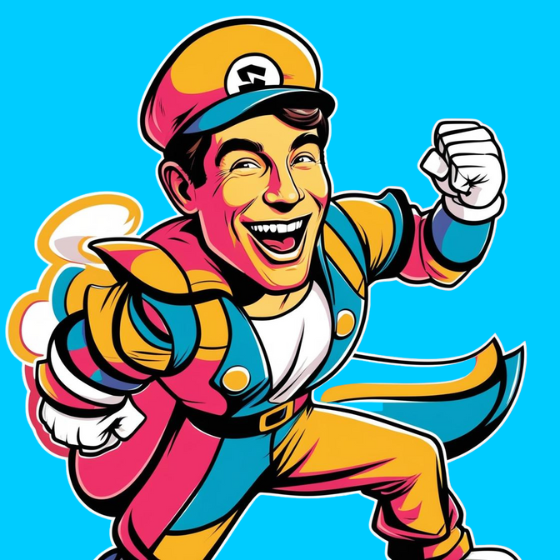

# Mr.Memory website 

## How to View the Project
- [View the live version here](https://blommis.github.io/memory-game/)

## Description
Mr.Memory is a fun and engaging memory game designed to challenge your cognitive skills and improve memory retention. In this game, players are tasked with matching pairs of hidden icons by flipping over cards. The objective is to uncover all pairs with the fewest moves possible.

## How to play
1. Start by entering your username: Type in your username to begin playing.

2. Flip the cards: Cards are arranged in a grid and initially hidden. Click on any card to flip it over and reveal its icon.

3. Match pairs: Try to find matching pairs of icons by remembering the cards you’ve flipped over.

4. Complete the game: The game ends once all pairs have been matched.

## Features
*  Challenging gameplay: Test your memory by matching pairs of different icons, from animals to objects.

* Simple, clean design: A straightforward interface that’s easy to navigate.

* Responsive: Optimized for both mobile and desktop devices for a seamless experience.

* Fun and engaging: Perfect for players of all ages looking to improve their memory skills in a playful setting.
## Wireframes

## Images

## Technologies Used
#### HTML 
for structure and content.

#### CSS 
for layout and styling.

#### JavaScript (coming soon)
 To handle the interactive logic and game functionality.

## Bugs discovered 
* I Had hard time to figure out why the game board wont work. Until I realized that my startGame function was being called, but the CreateBoardGame() function wasn’t included in it. Once I added CreateBoardGame() to the startGame function, the game board started working as expected.
* I encountered a bug while working on the scoring system for the memory game. The correct and wrong points were not increasing when I had a match or mismatch. After some troubleshooting, I realized the issue was caused by the placement of wrongPoints++. It was incorrectly placed inside the block where matches were being counted: 

The wrongPoints++ line was being executed even for correct matches, which was why the scoring logic didn’t work as intended. I fixed the issue by moving wrongPoints++ to the correct block where mismatched cards are handled:

## Validators testing
### HTML Valitdator
### CSS Valitdator
### Javascript Valitdator

## Manuel testing 

## Google fonts 

* Primary-font: "Funnel Sans", sans-serif
* Secondary-font: "Luckiest Guy", cursive

I chose "Funnel Sans" for its modern, clean look, providing readability and professionalism, making the game easy to navigate. "Luckiest Guy", a playful cursive font, adds a fun, creative touch, fitting the game's lighthearted and engaging theme. Together, they balance simplicity with personality, making the game both approachable and enjoyable.

## Credits
### Image Creation
* I generated the image of the fictional character using AI in Canva's Dream Lab. To create the image, I used the prompt: "Create a happy guy with costume game character." [Canva](https://www.canva.com/dream-lab).

### Code
* To make the feedback message move, I used keyframes.. I took inspiration and tips from [W3Schools](https://www.w3schools.com/cssref/atrule_keyframes.php).

