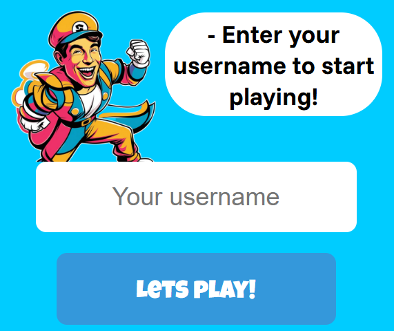
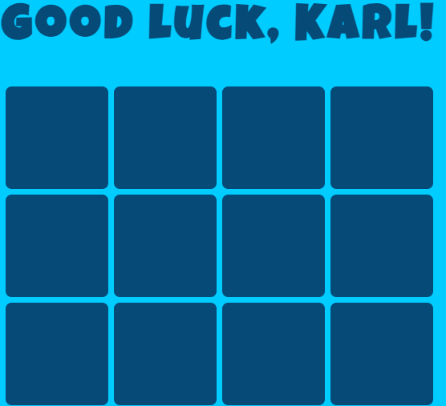
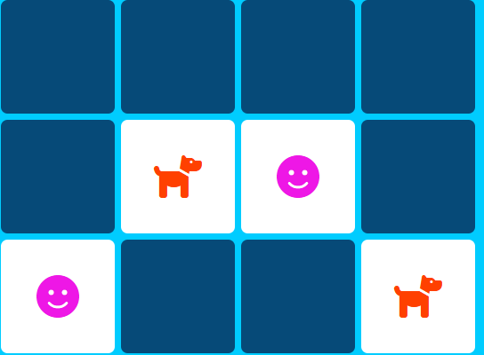
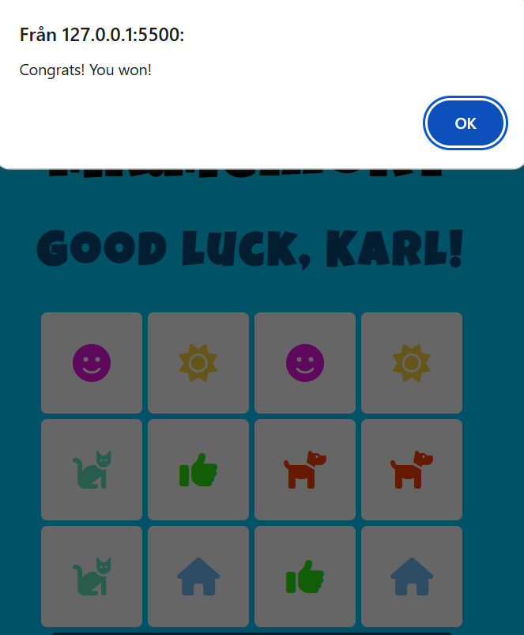
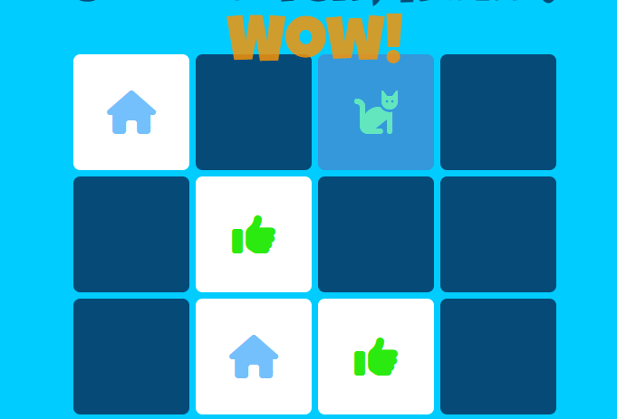

# Mr.Memory website 

## How to View the Project
- [View the live version here](https://blommis.github.io/memory-game/)

## Description
Mr.Memory is a fun and engaging memory game designed to challenge your cognitive skills and improve memory retention. In this game, players are tasked with matching pairs of hidden icons by flipping over cards. The objective is to uncover all pairs with the fewest moves possible.

## How to play
1. Start by entering your username: Type in your username to begin playing.

2. Flip the cards: Cards are arranged in a grid and initially hidden. Click on any card to flip it over and reveal its icon.

3. Match pairs: Try to find matching pairs of icons by remembering the cards you’ve flipped over.

4. Complete the game: The game ends once all pairs have been matched.

## Features
*  Challenging gameplay: Test your memory by matching pairs of different icons, from animals to objects.

* Simple, clean design: A straightforward interface that’s easy to navigate.

* Responsive: Optimized for both mobile and desktop devices for a seamless experience.

* Fun and engaging: Perfect for players of all ages looking to improve their memory skills in a playful setting.

## UX

The user experience for the Mr.Memory project was designed to provide an intuitive and engaging platform for players of all ages. The focus was on simplicity, responsiveness, and enjoyment.

### Design Goals
#### Ease of Use: 
Ensure a clean and simple interface that is easy to navigate.

#### Responsive Design:
 Optimize the game for various devices, including desktops, tablets, and mobile phones.

#### Interactive Feedback: 
Offer real-time responses and animations to keep players engaged.

## Project Goals
The Mr.Memory game aims to deliver an enjoyable and educational experience while testing and improving players' cognitive skills.

### Objectives
#### Enhance Memory Retention:
 Provide challenging gameplay that strengthens memory and concentration.

#### Universal Accessibility: 
Create a responsive and inclusive design suitable for all devices and age groups.

#### Engaging Gameplay: 
Develop a fun game that motivates players to improve their performance through scores and feedback.

#### Scalable Framework:
 Build a foundation for future enhancements, such as difficulty settings, leaderboards, and additional game themes.

## Player Goals
The game is tailored to meet the needs and expectations of players who seek fun and rewarding challenges.

### What Players Want
#### Challenge: 
A game that tests their memory and provides satisfaction upon matching pairs.

#### Engagement: 
Interactive elements like animations, scoring, and feedback messages to stay motivated.

#### Improvement: 
The ability to track progress and improve performance with repeated gameplay.

#### Entertainment:
 A fun and stimulating experience that is easy to pick up and play.

## How the Game Delivers
#### Interactive Design: 
Cards that flip with smooth animations and feedback messages enhance the gaming experience.

#### Score Tracking:
 Enables players to monitor their moves and strive for better results.

#### Completion Rewards: 
Motivational end-game messages create a sense of accomplishment.

## Wireframes

## User stories

### Must haves 
1. #### User Story:
As a player, I want to enter my username before starting the game so that my name can be displayed during gameplay.

#### Acceptance Criteria:
* The game displays an input field for entering a username.
* a "Let’s Play!" button is present.
* The game does not start until a username is entered.
* The entered username is displayed on the game screen.

#### Tasks:
* Add an input field for the username in the HTML.
* Add a "Let’s Play!" button that triggers the game start.
* Store the entered username and display it in the game UI.
* Prevent the game from starting if the input field is empty.

2. #### User Story:
As a player, I want to flip two cards at a time and check if they match so that I can progress in the game.

#### Acceptance Criteria:
* The player can click on a card to flip it.
* Two flipped cards stay visible until checked for a match.
* If the cards match, they remain face-up.
* If they don’t match, they flip back after a short delay.
* The game ends when all pairs are matched.

#### Tasks:
* Create an HTML structure for the cards.
* Add CSS for card styling and animations.
* Implement JavaScript logic to handle card clicks and matching.
* Add a delay before flipping unmatched cards back.
* Display a message when the game is completed.

3. ### User Story:
As a player, I want to see my score based on the number of points so that I can try to improve my performance.

#### Acceptance Criteria:
* Each move (flipping two cards) increases the correct or wrong points.
* The total moves are displayed during and after the game.

#### Tasks:
* Add a score counter in the UI.
* Update the counter on each move.
* Display the score at the end of the game.

## Should haves
### User Story:
As a player, I want to receive feedback messages on my progress so that I know how well I'm doing during the game.

#### Acceptance Criteria:
* A message appears when the player matches a pair.
* A final message appears when the game is completed, congratulating the player.

#### Tasks:
* Create a function to display feedback messages based on the player's actions.
* Implement logic to check if the selected cards match or not.
* Update the UI to show messages dynamically as the game progresses.

## Could have
### User Story:
As a player, I want smooth animations when flipping cards so that the game feels polished and fun.

#### Acceptance Criteria:
* Cards flip smoothly with a CSS animation.
* The animation duration is short and responsive.
* Cards should not flicker or behave unexpectedly.

#### Tasks:
* Add CSS animations for card flipping.
* Ensure animations work correctly on all devices.

## Images

## Technologies Used
#### HTML 
for structure and content.

#### CSS 
for layout and styling.

#### JavaScript (coming soon)
 To handle the interactive logic and game functionality.

## Google fonts 

* Primary-font: "Funnel Sans", sans-serif
* Secondary-font: "Luckiest Guy", cursive

I chose "Funnel Sans" for its modern, clean look, providing readability and professionalism, making the game easy to navigate. "Luckiest Guy", a playful cursive font, adds a fun, creative touch, fitting the game's lighthearted and engaging theme. Together, they balance simplicity with personality, making the game both approachable and enjoyable.

## Bugs discovered 
* I Had hard time to figure out why the game board wont work. Until I realized that my startGame function was being called, but the CreateBoardGame() function wasn’t included in it. Once I added CreateBoardGame() to the startGame function, the game board started working as expected.
* I encountered a bug while working on the scoring system for the memory game. The correct and wrong points were not increasing when I had a match or mismatch. After some troubleshooting, I realized the issue was caused by the placement of wrongPoints++. It was incorrectly placed inside the block where matches were being counted: 

The wrongPoints++ line was being executed even for correct matches, which was why the scoring logic didn’t work as intended. I fixed the issue by moving wrongPoints++ to the correct block where mismatched cards are handled:

## Validations testing
### HTML Valitdator
### CSS Valitdator
### Javascript Valitdator

## Lighthouse 

## Deployment 
The project was published to Github Pages by following step:
1. Log in to [GitHub](https://github.com/) and find the relevant GitHub repository
2. At the top of the repository (not the top of the page), look for the "settings" button in the menu. 
3. Scroll down the settings page until you come across the "pages" section.
4. Under /Build and deployment/source, click on the dropdown labeled "None" and select "main". 
5. The page will refresh automatically.
6. Scroll down again through the page to locate the link to the now-published site in the "GitHub pages" section
 

## Development Process and commands 
### Development Process
The development process was divided into several stages:
1. **Planning**: Wireframes and user stories were created to outline the structure and functionality.
2. **Development**: HTML, CSS, and JavaScript were used to build the game.
3. **Testing**: Functionality and responsiveness were tested on multiple browsers and devices.
4. **Deployment**: The final project was deployed using GitHub Pages.

### Common Commands
Here are some of the most frequently used commands during the development process:
- **Git Commands**:
  - `git clone <repository_url>`: Clone the repository to a local machine.
  - `git add .`: Stage all changes.
  - `git commit -m "commit message"`: Commit staged changes with a message.
  - `git push`: Push changes to the remote repository.
  - `git pull`: Pull the latest changes from the remote repository.

## Manuel testing 

### Family and Friends Testing
To ensure the game was enjoyable and accessible, family and friends were invited to test the Mr.Memory game. This collaborative testing process helped refine the game and ensure it provided an engaging and seamless experience for players of all ages and skill levels.

### browser testing
The functionality and responsiveness of the Mr.Memory game were carefully tested across various browsers and operating systems to ensure it provides a seamless experience for all users. Testing was conducted on Google Chrome, Microsoft Edge, and Safari to verify consistent performance and compatibility across different platforms. 

### Testing the card flip functionality
- Verified that clicking on a card reveals its icon.
- Ensured that matched pairs remain visible and unmatched cards are flipped back.

### Testing responsiveness
- Tested the game layout on desktop, tablet, and mobile devices using Chrome Developer Tools.
- Verified that the grid adjusts correctly on smaller screens.

### Testing the scoring system
- Ensured that correct matches increment the score.
- Checked that mismatched pairs correctly count as wrong moves.

## Credits

### Media
#### Image Creation
* I generated the image of the fictional character using AI in Canva's Dream Lab. To create the image, I used the prompt: "Create a happy guy with costume game character." [Canva](https://www.canva.com/dream-lab).

### Code
#### Feedback message 
* To make the feedback message move, I used keyframes.. I took inspiration and tips from [W3Schools](https://www.w3schools.com/cssref/atrule_keyframes.php).

## Finished Product

